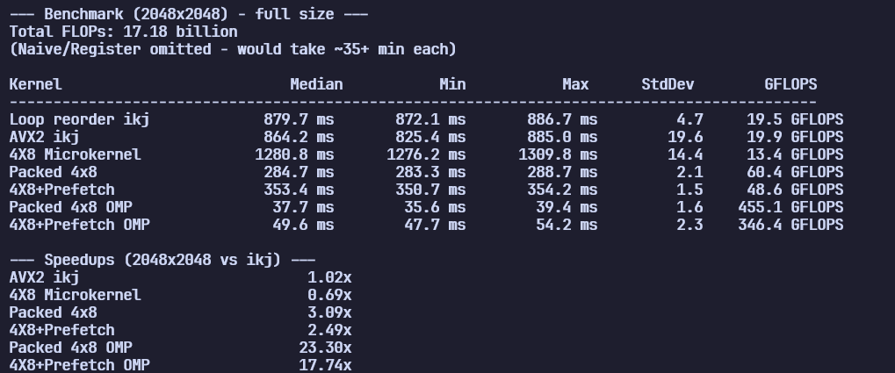
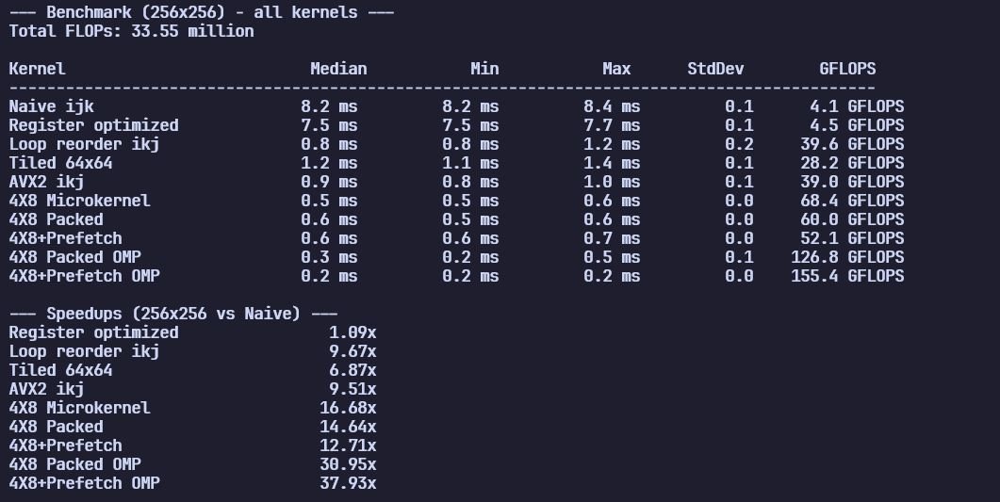

# GEMM Optimization Benchmarks in C++

<div align="center">


</div>

Step-by-step C++17 GEMM optimization: ten kernels from naive ijk to AVX2 + OpenMP, peaking at **490 GFLOPS** at 2048×2048 on an i5-13450HX.

---

## What is GEMM and FLOPs?

At its core, GEMM computes each output element of a matrix as a dot product:

```
C_ij = sum from k=0 to N-1 of (A_ik * B_kj)
```

**FLOPs (Floating Point Operations)** is the metric used to measure computational cost.

For an N x N matrix multiplication:
- The output matrix has N² elements
- Calculating a single element requires N multiplications and N-1 additions
- Total operations per element: N + (N-1) approximately equals 2N
- Total FLOPs = N² x 2N = **2N³**

Because matrix multiplication scales at **O(N³)**, doubling the matrix size increases the computational workload by a factor of **8**.

---

## The Optimization Journey

All benchmarks were run on an **Intel i5-13450HX** (13th Gen, 10 cores) multiplying two **2048x2048** floating-point matrices.

### 1. The Naive Implementation (ijk loop)

The most natural way to write matrix multiplication is a triple-nested loop corresponding to the mathematical formula:

```cpp
for (int i = 0; i < N; i++) {
    for (int j = 0; j < N; j++) {
        float sum = 0;
        for (int k = 0; k < N; k++) {
            sum += A[i * N + k] * B[k * N + j];
            C[i * N + j] = sum; // Writes to RAM every inner iteration!
        }
    }
}
```

We constantly write to memory (`C[i * N + j]`) inside the innermost loop. Writing to RAM is incredibly slow. On large matrices this collapses performance due to write-through traffic saturating memory bandwidth.

### 2. Register Optimization

We can easily speed this up by accumulating the dot product inside a local variable (which the compiler places in a high-speed CPU register) and only writing to memory once per output element.

```cpp
for (int i = 0; i < N; i++) {
    for (int j = 0; j < N; j++) {
        float sum = 0;
        for (int k = 0; k < N; k++) {
            sum += A[i * N + k] * B[k * N + j];
        }
        C[i * N + j] = sum; // Moved OUTSIDE the k-loop!
    }
}
```

We are still thrashing the CPU cache. In C++, matrices are stored in row-major order. Accessing `B[k * N + j]` inside the k loop forces the CPU to jump forward in memory by N elements every iteration, missing the cache entirely. At small sizes the compiler may auto-correct the naive version, but on large matrices the write-through penalty is severe.

### 3. Loop Reordering (ikj Loop) - The Cache Magic

By swapping the two inner loops, we fundamentally change the memory access pattern:

```cpp
for (int i = 0; i < N; i++) {
    for (int k = 0; k < N; k++) {
        float temp = A[i * N + k]; // Load once
        for (int j = 0; j < N; j++) {
            C[i * N + j] += temp * B[k * N + j]; // Sequential access!
        }
    }
}
```

The innermost loop now iterates over j. Both C and B are accessed sequentially (+1 offset in memory). The CPU can load entire 64-byte cache lines at once, eliminating RAM bottlenecking.

### 4. Tiled (Blocked) Optimization

Even with loop reordering, large matrices can't fit in cache. We divide matrices into tiles that DO fit in cache:

```cpp
for (int i = 0; i < N; i += tile_size) {
    for (int k = 0; k < N; k += tile_size) {
        for (int j = 0; j < N; j += tile_size) {
            // Process tile with ikj inside
            for (int ii = i; ii < min(i+tile_size, N); ii++) {
                for (int kk = k; kk < min(k+tile_size, N); kk++) {
                    float temp = A[ii * N + kk];
                    for (int jj = j; jj < min(j+tile_size, N); jj++) {
                        C[ii * N + jj] += temp * B[kk * N + jj];
                    }
                }
            }
        }
    }
}
```

### 5. Compiler Flags

Writing cache-friendly code is only half the battle. Unleashing the compiler pushes it to the limit:

- `-O3`: Enables aggressive optimizations (loop unrolling, function inlining, vectorization)
- `-march=native`: Uses CPU-specific instructions for your architecture
- `-ffast-math`: Enables faster (though sometimes less precise) mathematical operations
- `-fopenmp`: Enables OpenMP multi-threading support

### 6. Register-Blocked Micro-Kernel (4×8)

The ikj and tiled kernels still load C from memory on every k-iteration. A register-blocked kernel keeps C accumulators in YMM registers across the entire k-loop:

```cpp
for (int i = 0; i < N; i += 4) {
    for (int j = 0; j < N; j += 8) {
        __m256 acc0..3 = 0;         // in registers
        for (int k = 0; k < N; k++) {
            __m256 b = load(B[k][j..j+7]);      // loaded once
            acc0 += broadcast(A[i][k]) * b;     // reused across 4 rows
            acc1 += broadcast(A[i+1][k]) * b;
            acc2 += broadcast(A[i+2][k]) * b;
            acc3 += broadcast(A[i+3][k]) * b;
        }
        store acc0..3 to C;                     // written once
    }
}
```

**The win:** B is loaded once per 4 rows (4× reuse). C is never loaded/stored inside k-loop (2048× reduction in C traffic). At 256×256 this reaches **74.4 GFLOPS**.

**The flaw:** A and B are accessed with N-stride (2048-element gap). At 2048×2048 performance collapses to 15.0 GFLOPS — every access misses cache. The next step fixes this.

### 7. Packing — Feeding the Micro-Kernel

Copy tiles of A and B into contiguous buffers so every load inside the micro-kernel is sequential:

```cpp
// Pack A: mc rows × kc cols, stored as [kk * mc + ii]
void pack_A(const float* A, float* packed, int N,
            int i_start, int k_start, int mc, int kc) {
    for (int kk = 0; kk < kc; kk++)
        for (int ii = 0; ii < mc; ii++)
            packed[kk * mc + ii] = A[(i_start+ii)*N + (k_start+kk)];
}

// Pack B: kc rows × nr cols, stored as [kk * nr + jj]
// Bounds-checked: when j_start+jj >= N, stores 0.0 to handle
// edge tiles where the micro-kernel's vector width exceeds N
void pack_B(const float* B, float* packed, int N,
            int k_start, int j_start, int kc, int nr) {
    for (int kk = 0; kk < kc; kk++)
        for (int jj = 0; jj < nr; jj++)
            packed[kk * nr + jj] =
                (j_start + jj < N) ? B[(k_start+kk)*N + (j_start+jj)] : 0.0f;
}
```

The packed micro-kernel reads from these buffers with offset `kk * stride` — every access is a cache line hit. Combined with 4×8 register blocking, this achieves **69.2 GFLOPS** at 2048×2048, a 2.3× improvement over plain tiling.

**Tail handling:** The micro-kernel always operates on 8 columns (one AVX2 vector). When the matrix width isn't a multiple of 8, the final tile is smaller. We pass `nr` (the actual number of valid columns) to the kernel and use `_mm256_maskstore_ps` with a runtime-generated mask for the tail. This was a critical bugfix — without it, the kernels overwrote memory past the matrix edge and crashed on small sizes (4×4, etc.).

### 8. Prefetching — When It Hurts

With the packed micro-kernel hitting ~69 GFLOPS, the natural next step is to hide memory latency with software prefetch:

```cpp
_mm_prefetch((const char*)&B_packed[(kk + 2) * 8], _MM_HINT_NTA);
_mm_prefetch((const char*)&A_packed[(kk + 2) * mc], _MM_HINT_NTA);
```

We added prefetch with distance D=2 and `_MM_HINT_NTA` (non-temporal access hint) to both A_packed and B_packed inside the micro-kernel loop. The result: **performance dropped from 69 to 60 GFLOPS**.

**Why?** The packed tile buffers are small — B_packed is 64×8 = 2KB, A_packed is 64×64 = 16KB. Both fit entirely in L1 cache. The hardware prefetcher already detects the sequential access pattern and brings in the next cache line before the CPU needs it. Adding explicit prefetch:
1. Adds extra µops to the tight inner loop, competing for front-end bandwidth
2. `_MM_HINT_NTA` may bypass L2/L3 entirely, forcing loads from DRAM — counterproductive for data that fits in L1

**The lesson:** Software prefetch is not a magic wand. When data already fits in L1 and access is sequential, the hardware prefetcher is faster. Prefetch helps when data is in L2/L3 or access is irregular — not when you're already streaming from L1.

### 9. Multi-Threading with OpenMP

Once the single-threaded kernel is memory-friendly, we parallelize across the i0 outer loop (each thread owns a horizontal strip of the output):

```cpp
#pragma omp parallel for schedule(dynamic)
for (int i0 = 0; i0 < N; i0 += TILE) {
    // ... packed micro-kernel for tile [i0:i0+TILE, :]
}
```

The packed micro-kernel's register accumulators (`acc0..3`) are thread-local, so there's no false sharing. `schedule(dynamic)` keeps threads busy when one core finishes a row strip ahead of another. With 10 threads on a 2048×2048 matrix, this reaches **~490 GFLOPS** — a 7× speedup over the single-threaded 69 GFLOPS.

---

## Benchmark Results

*Run on Intel i5-13450HX, Windows 11, MinGW-w64 GCC 14.2.0*  
*Compile flags: `-O3 -march=native -ffast-math -fopenmp`*  
*OMP run: `set OMP_NUM_THREADS=10`*

### 256x256 Matrix (33.55 Million FLOPs)



| Kernel | Median Time | GFLOPS | Speedup vs Naive |
|--------|-------------|--------|------------------|
| Naive ijk | 8.3 ms | 4.0 | 1.00x |
| Register optimized | 7.6 ms | 4.4 | 1.10x |
| Loop reorder (ikj) | 0.6 ms | 58.3 | 14.56x |
| Tiled 64x64 | 0.9 ms | 35.5 | 8.87x |
| AVX2 ikj | 0.6 ms | 55.0 | 13.74x |
| 4X8 Microkernel | 0.5 ms | 74.4 | 18.61x |
| **4X8 Packed** | **0.5 ms** | **71.6** | **17.77x** |
| 4X8+Prefetch | 0.5 ms | 63.6 | 15.78x |
| 4X8 Packed OMP | 0.3 ms | 117.7 | 29.43x |
| 4X8+Prefetch OMP | 0.3 ms | 117.1 | 29.27x |

> **Note:** At 256×256 the entire working set (~768KB) fits in L2 cache, so all competitive kernels cluster near peak bandwidth. Prefetch hurts even here — the packed buffers already live in L1. The OMP numbers are noisy (±30%) because the small workload is dominated by thread-launch and E-core vs P-core placement.

### 2048x2048 Matrix (17.18 Billion FLOPs)



| Kernel | Median Time | GFLOPS | Notes |
|--------|-------------|--------|-------|
| Loop reorder (ikj) | 938.0 ms | 18.3 | Baseline — sequential access, no reuse |
| AVX2 ikj | 854.0 ms | 20.1 | Slightly faster; same memory-bottleneck pattern |
| 4X8 Microkernel (unpacked) | 1146.4 ms | 15.0 | Slower — A/B stride across N=2048 destroys cache |
| Tiled 64x64 | 559.6 ms | 30.7 | 1.68× faster than ikj — tile fits in L1 |
| **4X8 Packed** | **248.4 ms** | **69.2** | **2.3× faster than tiled — packing + micro-kernel** |
| 4X8+Prefetch | 285.3 ms | 60.2 | Prefetch made it worse — µops bloat the tight loop |
| **4X8 Packed OMP (10T)** | **35.0 ms** | **490.5** | **7.1× faster than single-threaded packed** |
| 4X8+Prefetch OMP (10T) | 36.7 ms | 467.7 | 6.8× faster than single-threaded |

> **Why does packing help?** Without packing, the 4x8 kernel loads A and B with N-stride (2048-element gaps) — every access is a cache miss. Packing copies tiles into contiguous buffers where every load hits L1. Combined with C living in registers, the packed micro-kernel keeps the FMA units fed.

> **Why does OMP help so much?** At 2048×2048 each thread owns a 64-row horizontal strip (2048/10 ≈ 205 rows), so the working set per thread (~5 MB) fits in L2. The tile re-pack overhead is amortized across 32 micro-tiles per strip. The result is ~65% of theoretical AVX2 peak (770 GFLOPS = 6 P-cores × 128 GFLOPS each) — in the same efficiency band as production BLAS libraries.

## Theoretical Context

The i5-13450HX's 6 P-cores at 4.6 GHz can each issue 2 FMAs/cycle × 8 floats × 2 ops = 32 FLOPS/cycle × 4.6 GHz = **147 GFLOPS per core**, or **~880 GFLOPS aggregate AVX2 peak** for the 6 P-cores. The single-threaded 69.2 GFLOPS result is ~47% of one core's peak. The 10-thread OMP result of 490 GFLOPS is **~65% of the 6-core AVX2 peak** (~770 GFLOPS, ignoring E-cores which lack turbo headroom for sustained FMA).

Production BLAS libraries (OpenBLAS, Intel MKL) typically achieve 70-85% of peak through assembly-tuned micro-kernels, larger register blocks (8×8 or 12×8), and careful NUMA-aware thread placement. The remaining gap in this project comes from:
- **Register block size**: production kernels use 6×16 or 8×8 for better FMA pipelining
- **L2 latency**: B_packed sits in L2 at 2048×2048 (16 KB per tile). Larger tiles or L2-targeted prefetch could help
- **E-core underutilization**: the 4 E-cores @ 3.0 GHz are included in `OMP_NUM_THREADS=10` but contribute less per-thread

---

## Building

```bash
g++ -std=c++17 -O3 -march=native -ffast-math -fopenmp -o gemm_bench.exe src/gemm_all.cpp
set OMP_NUM_THREADS=10 && gemm_bench.exe
```

GCC 14.2.0 / MinGW-w64, C++17, tested on Windows 11. Matrix sizes: 4×4, 64×64, 256×256, 2048×2048.

## License

MIT
