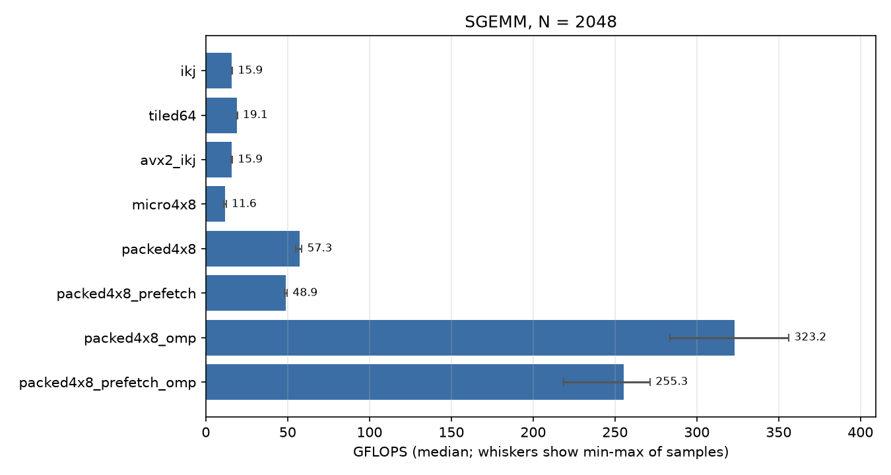

# Benchmarking-GEMM

[](https://github.com/cheese-cakee/Benchmarking-GEMM/actions/workflows/ci.yml)
[](LICENSE)

Single-precision matrix multiplication (SGEMM) in C++17, optimized one step at a time: from the
textbook triple loop to a packed, register-blocked AVX2 micro-kernel running on every core.
Each kernel isolates one idea, and every result is verified against a double-precision
reference before it is reported.

## Results

Intel Core i5-13450HX (6 P-cores + 4 E-cores), GCC 13.3 in WSL2 (Ubuntu 24.04), `-O3 -march=native
-ffast-math`, 10 OpenMP threads, laptop on AC power. Median of interleaved runs; every run verified.

| Kernel | N = 256 GFLOPS | N = 2048 GFLOPS | N = 2048 time |
| --- | ---: | ---: | ---: |
| `naive` | 3.5 | skipped by default | |
| `register` | 4.3 | skipped by default | |
| `ikj` | 30.7 | 15.9 | 1077 ms |
| `tiled64` | 23.9 | 19.1 | 899 ms |
| `avx2_ikj` | 31.9 | 15.9 | 1082 ms |
| `micro4x8` | 67.5 | 11.6 | 1484 ms |
| `packed4x8` | 63.1 | 57.3 | 300 ms |
| `packed4x8_prefetch` | 53.7 | 48.9 | 351 ms |
| **`packed4x8_omp`** | 102.1 | **323.2** | **53 ms** |
| `packed4x8_prefetch_omp` | 142.0 | 255.3 | 67 ms |



What the numbers show:

- **Memory access order matters more than instructions.** Reordering loops (`ikj`) is a 7× jump at
  N = 256; hand-written AVX2 on the same order (`avx2_ikj`) adds nothing, because the compiler
  already vectorizes it.
- **Register blocking wins in cache and collapses out of it.** `micro4x8` is the fastest
  single-threaded kernel at N = 256 and the slowest non-scalar one at N = 2048, where its
  column-strided reads miss the cache. Packing fixes that: 5× faster at N = 2048.
- **Software prefetch hurts** at both sizes: the packed buffers are already in L1.
- **Threads:** 5.6× from 10 threads at N = 2048. At N = 256 there are only four 64-row strips, so
  at most four threads have work and the result is noisy.
- **Against peak:** 323 GFLOPS is about 42% of the six P-cores' AVX2 peak at a sustained 4.0 GHz
  (768 GFLOPS). The [guide](docs/optimization-guide.md#4-where-the-remaining-gap-is) lists what
  closes the rest of the gap.

Raw samples with machine metadata: [`results/`](results). N = 256 uses 51 repetitions with no
pause; N = 2048 uses 7 repetitions with a 250 ms pause between runs. The same N = 2048 suite run
twice gave 321.0 and 323.2 GFLOPS for `packed4x8_omp`.

Earlier versions of this README reported 490 GFLOPS. That figure came from a packed kernel that
dropped all but the last 64-deep slice of each dot product (fixed in
[#1](https://github.com/cheese-cakee/Benchmarking-GEMM/pull/1)), measured natively on Windows. Long
native Windows runs on this laptop were also unreliable, with some runs 10× slower than short
ones (most likely the OS throttling a background process), so the published numbers come from
WSL2.

## How it works

Ten kernels, each adding one technique to the previous ones:

| Kernel | Idea | Source |
| --- | --- | --- |
| `naive` | Textbook `i, j, k` loops | [`scalar.cpp`](src/kernels/scalar.cpp) |
| `register` | Accumulate the dot product in a register | [`scalar.cpp`](src/kernels/scalar.cpp) |
| `ikj` | Reorder loops so `B` and `C` are read along rows | [`scalar.cpp`](src/kernels/scalar.cpp) |
| `tiled64` | 64 × 64 cache blocking | [`tiled.cpp`](src/kernels/tiled.cpp) |
| `avx2_ikj` | `ikj` with explicit AVX2 FMA intrinsics | [`avx2.cpp`](src/kernels/avx2.cpp) |
| `micro4x8` | 4 × 8 block of `C` held in registers | [`avx2.cpp`](src/kernels/avx2.cpp) |
| `packed4x8` | Pack tiles of `A` and `B` so the micro-kernel reads contiguous memory | [`packed.cpp`](src/kernels/packed.cpp) |
| `packed4x8_prefetch` | Add software prefetch (it hurts; see the guide) | [`packed.cpp`](src/kernels/packed.cpp) |
| `packed4x8_omp` | Parallelize row strips with OpenMP | [`packed.cpp`](src/kernels/packed.cpp) |
| `packed4x8_prefetch_omp` | Both of the above | [`packed.cpp`](src/kernels/packed.cpp) |

[**The optimization guide**](docs/optimization-guide.md) explains each step from first
principles: FLOP counting, the cache hierarchy, arithmetic intensity, register blocking,
packing, why prefetching made things worse, and where the remaining gap to BLAS comes from.

## Build and run

Requirements: a C++17 compiler (GCC 9+ or Clang 10+; MinGW-w64 on Windows), CMake 3.16+, OpenMP,
and an x86-64 CPU with AVX2 and FMA.

```bash
cmake -S . -B build                 # Release, tuned with -march=native
cmake --build build -j
ctest --test-dir build              # correctness tests
./build/gemm_bench                  # benchmark N = 256 and N = 2048
```

On Windows with MinGW-w64, add `-G "MinGW Makefiles"` to the first command.

`gemm_bench` options:

```text
--sizes 256,2048       matrix sizes
--kernels a,b          subset of kernels (see --list); naive/register run only for N <= 512 by default
--warmup W --reps R    untimed and timed runs per kernel (default 2 and 5)
--threads T            OpenMP threads
--cooldown-ms MS       pause between timed runs to limit thermal drift
--csv PATH             write every sample, with CPU, compiler, and flags in the header
```

Kernels are interleaved within each repetition, so slow drift in clocks or temperature spreads
across all kernels instead of favouring whichever ran first. Every timed run is spot-checked
against a double-precision dot product; `gemm_bench` exits non-zero if any check fails.

To regenerate the charts from a CSV: `python scripts/plot.py results/<file>.csv`.

## Testing

`ctest` runs two tests:

- **correctness**: every kernel at 15 sizes from 1 to 200, including one short of, exactly at,
  and one past each tile edge (4 rows, 8 columns, 64-wide tiles), and sizes spanning several
  64-deep k-tiles. Results are compared with a double-precision reference using the standard
  floating-point dot-product error bound. `C` is pre-filled with NaN so a kernel that reads `C`
  before writing it fails.
- **bench_smoke**: one short benchmark run, which must pass its own spot checks.

CI runs both with GCC and Clang, plus a Debug build under AddressSanitizer and
UndefinedBehaviorSanitizer.

## Repository layout

```text
include/gemm/kernels.hpp     kernel declarations and the kernel registry
src/kernels/                 the kernels, grouped by technique
src/registry.cpp             kernel names in guide order
tests/test_correctness.cpp   correctness tests against a double-precision reference
bench/gemm_bench.cpp         benchmark driver
scripts/plot.py              CSV to charts
results/                     raw benchmark samples with machine metadata
docs/                        optimization guide and charts
```

## Limitations and next steps

- Square matrices only, row-major, single precision.
- The kernels are teaching steps, not a BLAS replacement. The largest remaining gains, in the
  order they would likely pay off: a 6 × 16 micro-kernel (12 accumulators, enough independent
  FMAs to keep both FMA units busy), BLIS-style three-level blocking sized to L1/L2/L3, packing
  each `B` block once and sharing it across threads, allocating aligned packing buffers once
  instead of inside the loop, and P-core/E-core-aware scheduling.
- Numbers come from one laptop. Laptop power limits change sustained clocks; compare runs only
  when they share a machine, power state, and build.

## License

MIT
